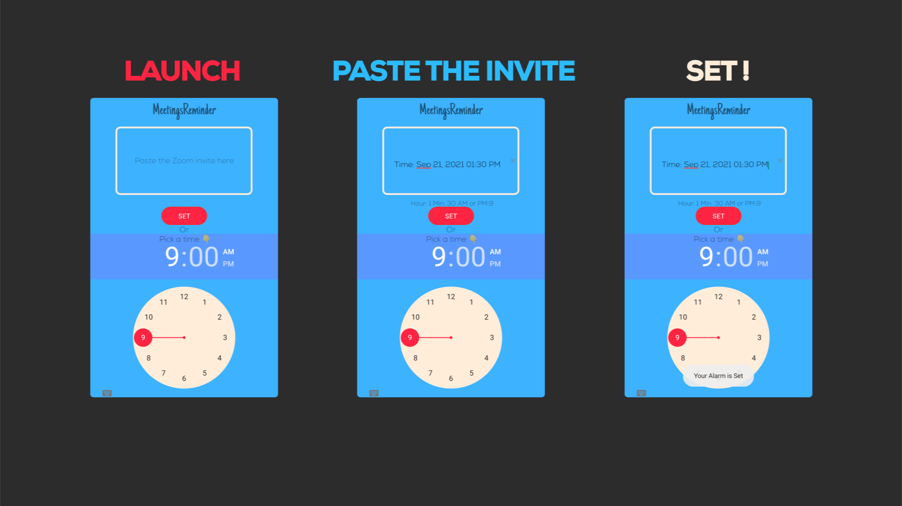

MeetingsReminder
=================

A simple reminder app but BETTER!
The app lets you add reminder just by pasting your Zoom meeting invite.(Support for Zoom only because only zoom has Formatted invites) It also has Timepicker in case you want to use it as normal reminder.
This is my very first Project so there are many things that can be improved.

How it works⚙️
-----------
The App accepts a string input through EditText View and the Time Of the meeting is then extracted by using simple ".subString()" method of Java Strings.
And the extracted time is then parsed into integer using "Integer.parseInt()".
This project uses the Gradle build system.

Using the App 📱
-----------

* Launch the app.

* Copy Your Zoom invitation which may look like this-->

```
Prof. Snape is inviting you to a scheduled Zoom meeting.

Topic:  Defence Against the Dark Arts
Time: May 2, 1998 01:30 PM Hogwarts

Join Zoom Meeting
https://us02web.zoom.us/j/*****?pwd=MkwwckloRjlHVVplemZEK

Meeting ID: 123 456
Passcode: 123
```

* And Paste it into the box and click SET.



* Here you go phone will play the default Alarm tune on the given time.

Note: Currently the app can handle only one reminder at a time.
---

Libraries Used📖
-----------

* [Custom EditText][0] - For the rounded input box.
* [Material Components][1] - For the material design Button.

[0]:
https://github.com/Rajagopalr3/CustomEditText
[1]:
https://github.com/material-components
